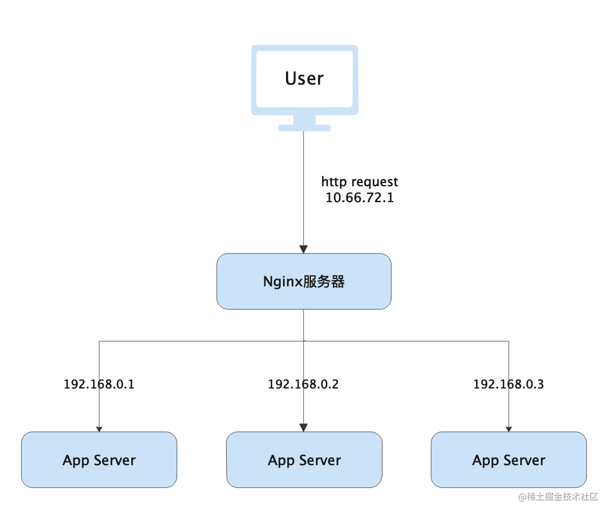

# docker+Nginx实现简易负载均衡
## docker-compose启动Nginx


准备4个Nginx容器，1个用来做负载均衡服务器，3个是App Server

### 负载均衡服务器配置nginx.conf
```shell
user  nginx;
worker_processes  auto;

error_log  /var/log/nginx/error.log warn;
pid        /var/run/nginx.pid;

events {
    worker_connections  10240;
}

http {
    include       /etc/nginx/mime.types;
    default_type  application/octet-stream;

    log_format  main  '$remote_addr - $remote_user [$time_local] "$request" '
                      '$status $body_bytes_sent "$http_referer" '
                      '"$http_user_agent" "$http_x_forwarded_for"';

    access_log  /var/log/nginx/access.log  main;

    sendfile        on;
    #tcp_nopush     on;

    keepalive_timeout  65;

    #gzip  on;

    upstream backend-server {
        server app-server1:80;
        server app-server2:80;
        server app-server3:80;
    }
    server {
	server_name localhost;
	listen 80 ;
	access_log /var/log/nginx/access.log;
	location / {
		proxy_pass http://backend-server;
	}
    }
}
```
- 由于4个容器都在同一docker网络中，因此在配置 upstream 模块时，可以直接使用容器名称.

### docker-compose.yml
```yml
version: '3'
services:
  nginx-load-balancing:
    image: nginx:alpine
    container_name: nginx-load-balancing
    ports:
      - "9090:80"
    volumes:
      - ./nginx.conf:/etc/nginx/nginx.conf
    depends_on:
      - app-server1
      - app-server2
      - app-server3

  app-server1:
    image: nginx:alpine
    container_name: app-server1

  app-server2:
    image: nginx:alpine
    container_name: app-server2

  app-server3:
    image: nginx:alpine
    container_name: app-server3

networks:
  default:
    driver: bridge
```

- 使用 docker-compose up -d 启动应用
- 分别进入容器 app-server1 ， app-server2 ，app-server3 ，在 /usr/share/nginx/html/index.html 中标注当前的容器名称，使用浏览器访问 http://localhost:9090 

结果如下：


## 使用Nginx负载均衡Go后端接口
### Nginx
使用上述的nginx-load-balancing容器

### nginx.conf
```shell
user  nginx;
worker_processes  auto;

error_log  /var/log/nginx/error.log warn;
pid        /var/run/nginx.pid;

events {
    worker_connections  10240;
}

http {
    include       /etc/nginx/mime.types;
    default_type  application/octet-stream;

    log_format  main  '$remote_addr - $remote_user [$time_local] "$request" '
                      '$status $body_bytes_sent "$http_referer" '
                      '"$http_user_agent" "$http_x_forwarded_for"';

    access_log  /var/log/nginx/access.log  main;

    sendfile        on;
    #tcp_nopush     on;

    keepalive_timeout  65;

    #gzip  on;
    #注意这里要更改为自己宿主机的ip,用ifconfig查询宿主机ip
    upstream backend-server {
        server 172.20.10.5:3001;
        server 172.20.10.5:3002;
        server 172.20.10.5:3003;
    }
    server {
	server_name localhost;
	listen 80 ;
	access_log /var/log/nginx/access.log;
	location / {
		proxy_pass http://backend-server;
	}
    }
}
```

### 测试接口main.go
```go
package main

import (
	"net/http"
	"os"
	"strings"
)

var post string = ":3001"

func main() {
	http.HandleFunc("/test", handleReq)
	http.ListenAndServe(post, nil)
}

//处理请求函数,根据请求将响应结果信息写入日志
func handleReq(w http.ResponseWriter, r *http.Request) {
	failedMsg := "handle in port:"
	writeLog(failedMsg, "./stat.log")
}

//写入日志
func writeLog(msg string, logPath string) {
	fd, _ := os.OpenFile(logPath, os.O_RDWR|os.O_CREATE|os.O_APPEND, 0644)
	defer fd.Close()
	content := strings.Join([]string{msg, "\r\n"}, post)
	buf := []byte(content)
	fd.Write(buf)
}
```
```
// 在本地同时起三个端口分别为3001、3002、3003的服务
go run main.go

// 压力测试，结果会在"./stat.log"中生成
ab -n 1000 -c 100 http://localhost:9090/test
```

## 负载均衡upstream分配方式
- 轮询

这是默认的分配方式，根据请求的时间顺序均匀的分配到每个服务器
```
upstream backend-server {
    server app-server1:80;
    server app-server2:80;
    server app-server3:80;
}
```
- weight

这是轮询的加强版，没有设置取默认值1，负载均衡服务器会以 1:2:3 的比例将请求转发到3台服务器，主要用于服务器配置差异的场景
```
upstream backend-server {
    server app-server1:80;
    server app-server2:80 weight=2;
    server app-server3:80 weight=3;
}
```

- ip_hash

根据每个请求IP地址的Hash结果进行分配，使得每个访客会固定访问同一台服务器
```
upstream backend-server {
    ip_hash;
    server app-server1:80;
    server app-server2:80;
    server app-server3:80;
}
```

- fair

根据后端服务器响应时间来分配，响应时间越短越优先
```
upstream backend-server {
    server app-server1:80;
    server app-server2:80;
    server app-server3:80;
    fair;
}
```

- url_hash

根据访问url的hash结果来分配请求，使得每个url会固定访问同一台服务器，使用了hash算法则server中不能再使用weight等参数。
```
upstream backend-server {
    server app-server1:80;
    server app-server2:80;
    server app-server3:80;
    hash $request_uri;    hash_method crc32;
}
```

## 参考
- [使用Docker+Nginx实现简易负载均衡](https://juejin.cn/post/6885618130471780366)
- [12306 是如何支撑百万 QPS 的？](https://jishuin.proginn.com/p/763bfbd6fa21)